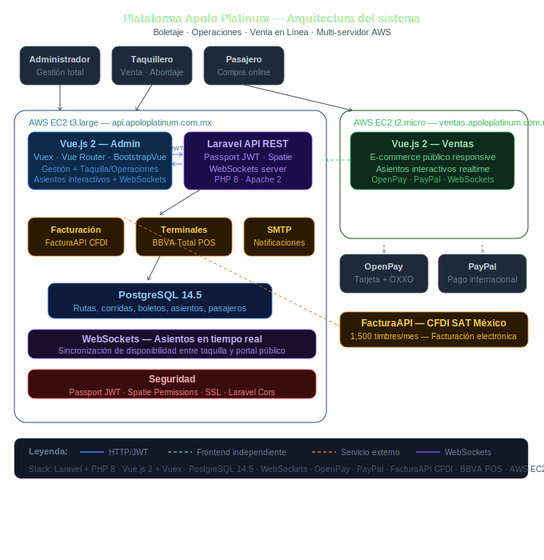

# 📋 Caso de Estudio — Plataforma Apolo Platinum

> **Nota:** Este repositorio es un caso de estudio técnico. El código fuente es confidencial por acuerdo con el cliente (Apolo Platinum). Se documenta la arquitectura, decisiones técnicas y alcance del proyecto con fines de referencia profesional.

---

## 🏛️ Contexto

| | |
|---|---|
| **Cliente** | Apolo Platinum — Línea de autobuses con sede en Monterrey, operaciones nacionales y EUA |
| **Proyecto** | Plataforma integral de operación, boletaje y venta en línea |
| **Empresa** | Importare Software SA de CV |
| **Mi rol** | **Desarrollador Frontend** (módulo administrativo completo) + **Arquitecto de nuevas funcionalidades** (abordaje, facturación, asientos en tiempo real) |
| **Período** | 2021 – Actualidad |

---

## 🎯 Problema

Apolo Platinum operaba con **aplicaciones de escritorio obsoletas** para la gestión de rutas y venta en taquilla, sin canal de venta directa al público y sin control en tiempo real de disponibilidad de asientos — lo que generaba ventas duplicadas y procesos manuales ineficientes.

Dos objetivos clave del proyecto:
1. **Modernización operativa** — migrar de escritorio a web para logística, planeación de rutas y venta en taquilla
2. **Nuevo canal de venta** — e-commerce público responsive para compra directa de boletos

---

## ✅ Solución

Se diseñó e implementó una plataforma con **tres aplicaciones independientes** desplegadas en infraestructura AWS multi-servidor:

### 1. App Administrativa — Gestión (`operaciones.apoloplatinum.com.mx`)
Módulo de gestión y configuración del negocio:
- Ciudades, terminales, agencias y rutas
- Layouts de autobús con editor interactivo de asientos
- Unidades, operadores y corridas (salidas programadas)
- Precios por tramo con importación/exportación masiva
- Descuentos y autorizaciones
- Reportes y estadísticas operativas

### 2. App Administrativa — Operativa (taquilla)
Módulo de operación en punto de venta:
- **Venta de boletos** con selección interactiva de asientos en tiempo real (WebSockets)
- Control de corridas: asignación de unidad, operadores y sub-corridas
- **Abordaje digital** — lista de pasajeros, confirmación de salida, canje de blancos
- Gestión completa de boletos: canje, anulación, reimpresión, venta de equipaje
- **Facturación electrónica CFDI** vía FacturaAPI
- Integración con **terminales bancarias BBVA Total POS** para pago con tarjeta en taquilla
- Canje masivo de boletos por corrida

### 3. Portal de Venta en Línea (`ventas.apoloplatinum.com.mx`)
E-commerce público para compra de boletos:
- Búsqueda de rutas y corridas disponibles
- **Selección interactiva de asientos** con control de disponibilidad en tiempo real (WebSockets)
- Tres estados de boleto: contado, reserva y blanco
- Pasarelas de pago: **OpenPay** (tarjeta + tiendas de conveniencia) y **PayPal**
- Facturación electrónica disponible para el pasajero

---

## 🏗️ Arquitectura



```
┌─────────────────── AWS EC2 t3.large ──────────────────────┐
│         api.apoloplatinum.com.mx (API + Operaciones)      │
│                                                           │
│  ┌──────────────────────────────────────────────────┐    │
│  │         Laravel (API REST + Passport JWT)         │    │
│  │                                                   │    │
│  │  • Lógica de negocio multi-módulo                 │    │
│  │  • WebSockets — control asientos en tiempo real   │    │
│  │  • Integración FacturaAPI (CFDI)                  │    │
│  │  • Integración BBVA Total POS (Pinpad taquilla)   │    │
│  │  • Spatie Permissions · Laravel Passport          │    │
│  │  • Notificaciones SMTP                            │    │
│  └─────────────┬────────────────────────────────────┘    │
│                │                                          │
│  ┌─────────────▼────────────────────────────────────┐    │
│  │   Vue.js 2 — App Administrativa (Gestión + Venta) │    │
│  │   Vuex · Vue Router · BootstrapVue · Axios        │    │
│  └──────────────────────────────────────────────────┘    │
│                                                           │
│  ┌──────────────────────────────────────────────────┐    │
│  │         PostgreSQL 14.5                           │    │
│  │  Rutas, corridas, boletos, pasajeros, asientos    │    │
│  └──────────────────────────────────────────────────┘    │
└───────────────────────────────────────────────────────────┘

┌─────── AWS EC2 t2.micro ────────────────────────────────┐
│       ventas.apoloplatinum.com.mx (E-commerce)          │
│                                                         │
│  Vue.js 2 — Portal público de venta en línea           │
│  OpenPay · PayPal · WebSockets (asientos real-time)    │
└─────────────────────────────────────────────────────────┘
```

---

## ⚙️ Patrones de Arquitectura Implementados

**API REST desacoplada con Passport JWT**
Backend Laravel expuesto como API pura consumida por dos frontends independientes — app administrativa y portal de ventas. Autenticación stateless con tokens JWT vía Laravel Passport.

**WebSockets para control de asientos en tiempo real**
La selección de asientos es un problema de concurrencia — si dos usuarios seleccionan el mismo asiento simultáneamente se genera una venta duplicada. Implementé la solución con WebSockets que sincronizan el estado de disponibilidad en tiempo real entre todas las sesiones activas, tanto en taquilla como en el portal público.

**Multi-servidor en AWS**
Tres instancias EC2 con responsabilidades separadas: API + Operaciones (t3.large), Portal de ventas (t2.micro) y servidor de pruebas (t2.micro). Separación que permite escalar cada capa de forma independiente.

---

## 🛠️ Stack Tecnológico

| Capa | Tecnología |
|---|---|
| **Backend** | PHP 8 / Laravel + Laravel Passport (JWT) |
| **Frontend admin** | Vue.js 2 + Vuex + Vue Router + BootstrapVue |
| **Frontend ventas** | Vue.js 2 + Vue Router + Axios |
| **Base de datos** | PostgreSQL 14.5 |
| **Tiempo real** | WebSockets — control de disponibilidad de asientos |
| **Facturación** | FacturaAPI — CFDI electrónico (SAT México) |
| **Pagos online** | OpenPay (tarjeta + OXXO/tiendas) + PayPal |
| **Pagos taquilla** | BBVA Total POS — terminales Pinpad |
| **Infraestructura** | AWS EC2 (3 instancias) — Apache 2 |
| **Notificaciones** | SMTP |

---

## 🔌 Integraciones Externas

| Servicio | Función |
|---|---|
| **FacturaAPI** | Emisión de CFDI — facturación electrónica SAT para boletos |
| **OpenPay** | Pagos online — tarjeta crédito/débito + tiendas de conveniencia |
| **PayPal** | Pasarela de pago alternativa para ventas en línea |
| **BBVA Total POS** | Terminales Pinpad para pago con tarjeta en taquilla |
| **AWS EC2** | Infraestructura multi-servidor de producción |

---

## 👥 Roles del Sistema

| Rol | Acceso |
|---|---|
| **Administrador** | Gestión total — rutas, unidades, precios, usuarios |
| **Taquillero** | Venta, abordaje, canje y anulación de boletos |
| **Operador** | Consulta de corridas asignadas |
| **Público** | Portal de ventas en línea |

---

## 📊 Mi Aportación Específica

- ✅ **Desarrollo completo del frontend administrativo** — ambos módulos (gestión y operativa/taquilla) en Vue.js 2
- ✅ **Implementación de asientos interactivos con WebSockets** — tanto en taquilla como en portal público, previniendo ventas duplicadas en tiempo real
- ✅ **Arquitectura y modelado de nuevas funcionalidades** — abordaje digital mejorado, flujo de facturación y mejoras de UX en módulos operativos
- ✅ **Propuestas de interfaz** — nuevos diseños para módulos de abordaje, facturación y gestión de corridas

---

## 📊 Impacto

- ✅ Migración completa de aplicaciones de escritorio obsoletas a plataforma web
- ✅ Nuevo canal de venta directa al público con e-commerce responsive
- ✅ Control de disponibilidad de asientos en tiempo real — eliminación de ventas duplicadas
- ✅ Integración con terminales bancarias físicas en taquilla
- ✅ Facturación electrónica CFDI automatizada para pasajeros y operadores
- ✅ Infraestructura multi-servidor en AWS escalable por capa

---

## 🔐 Nota de Confidencialidad

El código fuente de este proyecto es propiedad de Importare Software SA de CV y fue desarrollado bajo contrato con Apolo Platinum. No se publica por acuerdo de confidencialidad con el cliente.

---

## 👤 Autor

**Cristhian Zavala**
Arquitecto de Software | Importare Software SA de CV
- 🔗 [LinkedIn](https://linkedin.com/in/cristhianszt)
- 🐙 [GitHub](https://github.com/CristhianSZT)
